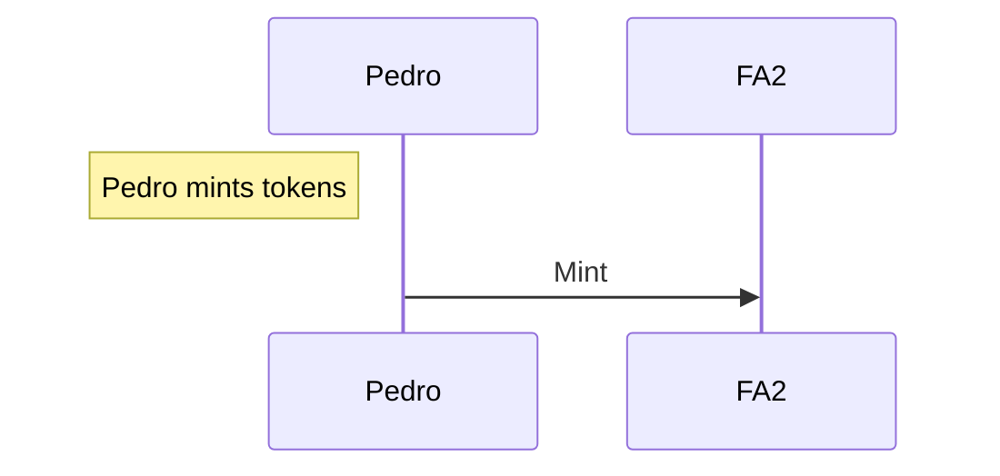
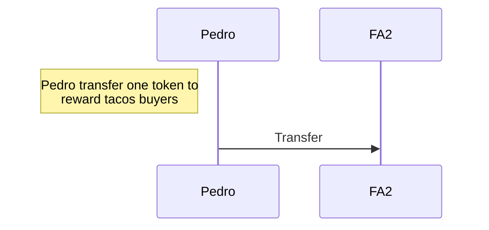
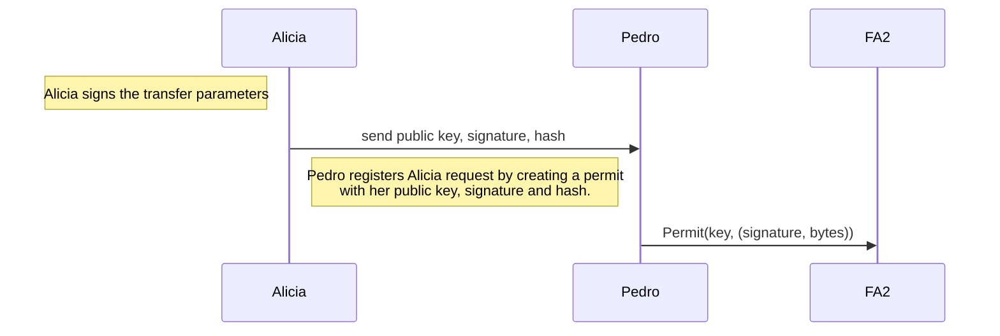
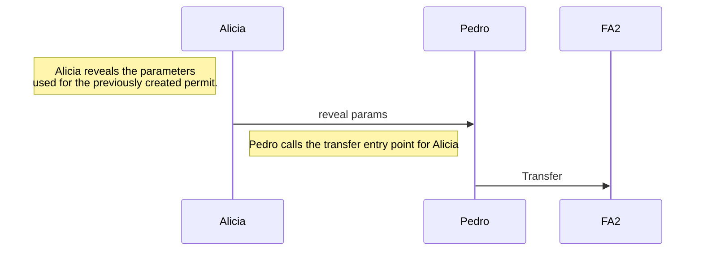
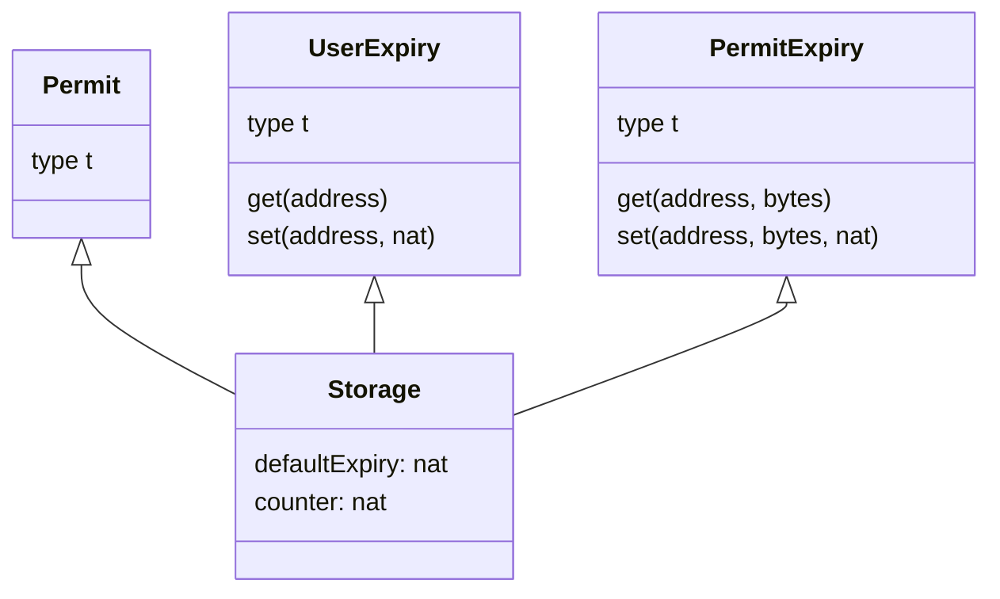

# permit-cameligo

This example contract implements an FA2 multi-asset contract with a
[TZIP-17](https://tzip.tezosagora.org/proposal/tzip-17/) extension.

In this implementation, permits can be submitted and consumed in [**separate-steps**](https://gitlab.com/tezos/tzip/-/blob/master/proposals/tzip-17/tzip-17.md#separate-step-permit).

## Why permits?

Permits have 2 main use cases:

- making gasless transaction
- avoiding manipulating operators (FA2) or allowances (FA1.2) when a transaction
must be done by a third-party

## Entrypoints

On top of FA2 standard, the following entrypoints are implemented:

- `permit`: allows any sender to register a permit.
- `setExpiry`: allows any sender to change its expiry configuration for its own permits.
- `transfer`: overrides FA2 `transfer` to add the handling of permitted parameters.

Additionally, for the use case presentation, 3 entrypoints have been added:

- `create_token`: creates a token.
- `mint_token`: mint a token.
- `burn_token`: burn a token.

## Use case: taco shop loyalty program

A potential use case is the digitalization of the good old loyalty card.  

### Loyalty Token creation

Expanding on the taco shop tutorial, let's say Pedro creates a new token to
reward his customers.

### Token distribution

Pedro rewards his customers with one token for each taco bought.

### Permit creation

Alicia is a regular client of the taco shop.  
She already accumulated 10 tokens, which can be exchanged for a free taco.  
One day, she happens to be out of tez, so she decides to use her tokens to pay.

So, she asks Pedro to create a permit.  
The permitted action will be the transfer of 10 tokens from Alicia to Pedro.  
Once Pedro has verified the permit parameters given by Alicia, he calls the smart
contract with them, registering the permit.

### Permit consumption

The last step consists in Alicia asking Pedro to consume the permit, by revealing
him the parameters she used for the permit creation, allowing Pedro to call the
`transfer` entrypoint with these parameters, actually consuming the permit.

## Smart Contract Data Types

## Resources

- <https://news.ecadlabs.com/understanding-permits-on-tezos-tzip-17-standard-7e470684265c>
