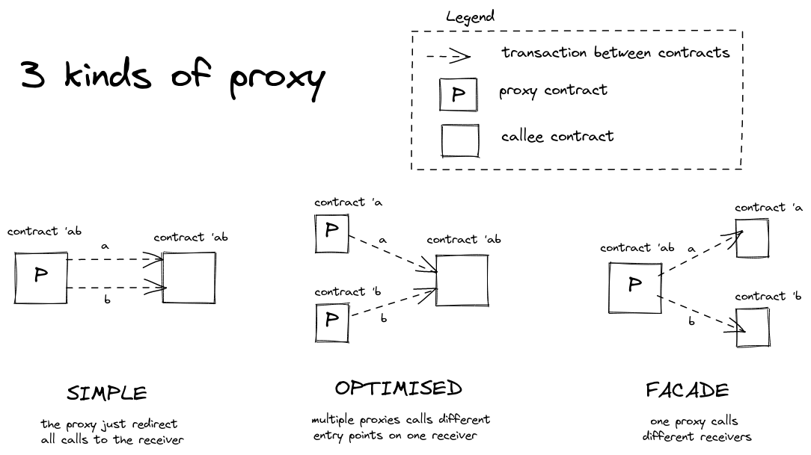

# Proxies

A proxy let you provide a value of the [*contract type*](https://tezos.gitlab.io/michelson-reference/#type-contract)
as substitute or placeholder of another *contract type*

## When to use it

- You want to perform something either before or after the call gets to the
callee contract.
- You want to have an upgradable contract.

## 3 different kinds of proxy

We can distinguish 3 kinds of proxy:

- A [Simple Proxy](./simple) just redirects all its calls to another contract
of which it implements all entry points.
- An Optimised Proxy also redirects its calls to another contract,
but it doesn't implements all the callee entry points.
- A Facade Proxy redirects its calls to multiple other contracts.

Ecosystem references:

- [Tezos Domains](https://tezos.domains/) is [using proxies](https://developers.tezos.domains/design-document/smart-contract-overview#proxy-contracts)
is a way described as "optimised proxy" above.
- [Kolibri](https://kolibri.finance) is [using proxies](https://kolibri.finance/docs/components/oven-proxy)
in a way described as "simple proxy" above.
