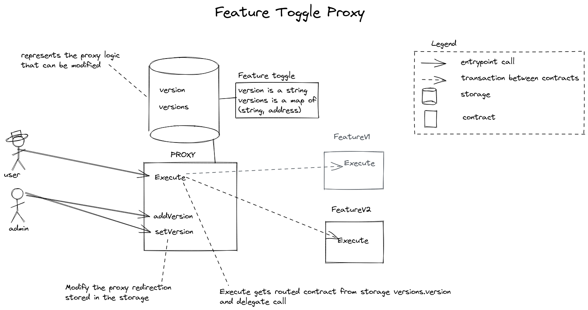
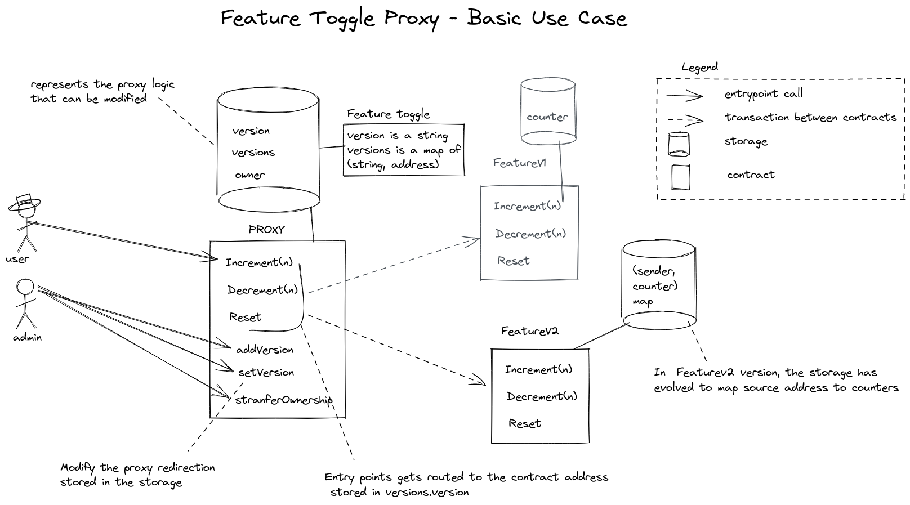

# Simple Proxy

The proxy delegates its calls to another contract (the **receiver**).

It may add some logic before or after calling the receiver.

**Use case: using a proxy as [feature toggle](https://en.wikipedia.org/wiki/Feature_toggle),
the proxy manages a list of receiver contracts and can toggle between them.**

## Overview



## Workflow

With this basic example, we re-used the contract from ligolang website's
[getting started](https://ligolang.org/docs/tutorials/getting-started/getting-started)
tutorial.

This contract will be used as **featurev1** receiver contract, later we'll
deploy a **featurev2** contract which is an evolution of the contract.

**Featurev1** and **featurev2** have the same interface, so that the proxy can
delegate to either one of them.

The proxy allows a configured admin to add new versions of the receiver contract,
and set the current one.



## Errors

Error | Description
---|---
`PROXY_UNDEFINED_VERSION` | The version is not defined, or there is no route with this version
`PROXY_UNDEFINED_RECEIVER` | The routed address and entry point does not return a contract
`PROXY_SENDER_NOT_ALLOWED` | The sender is not allowed to call this entry point
`PROXY_NOT_ZERO_AMOUNT` | The amount of tez is not equal to 0

## Entrypoints

### Admin Entrypoints

- [add_version](#add_version)
- [set_version](#set_version)
- [transfer_ownership](#transfer_ownership)

#### add_version

Add a new receiver.

Parameter (in Michelson)

```michelson
(pair %addVersion (address %dest) (string %label))
```

#### set_version

Set current receiver.

Parameter (in Michelson)

```michelson
(string %setVersion)
```

#### transfer_ownership

Transfer admin rights.

Parameter (in Michelson)

```michelson
(address %transferOwnership)
```

### Delegated Entrypoints

- [increment](#increment)
- [decrement](#decrement)
- [reset](#reset)

#### increment

Delegates to receiver `increment` entrypoint, it has the same signature.

Parameter (in Michelson)

```michelson
(int %increment)
```

#### decrement

Delegates to receiver `decrement` entrypoint, it has the same signature.

Parameter (in Michelson)

```michelson
(int %decrement)
```

#### reset

Delegates to receiver `reset` entrypoint, it has the same signature.

Parameter (in Michelson)

```michelson
(unit %reset)
```
