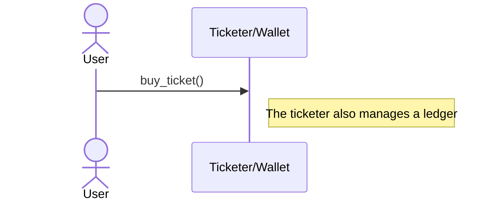
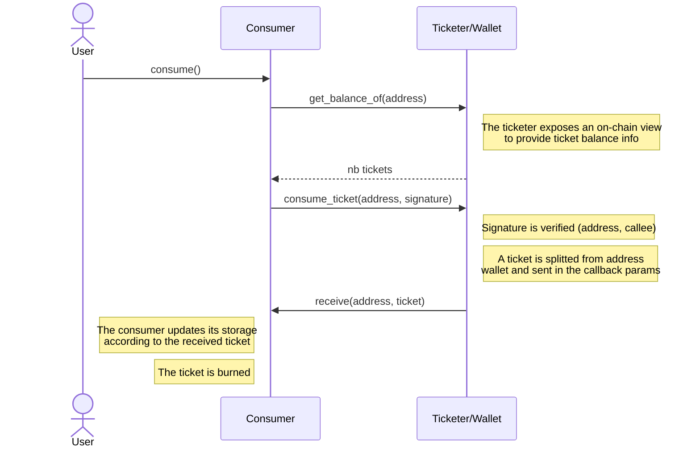

# Ticketing

This smart contract intends to handle a subscription to a service of car parking. 

The goal is to provide an example of implementation of tickets, which introduces 
a permission-based access.

Tickets are secure to use and resistant to tampering without setting up complex
permissions management.  

You can simply distribute tickets and control who accesses what and for how many times.

## Functional Overview

### Subscription

User can spend XTZ to buy a subscription to a car parking system.  
This subscription allow users to use a service (car parking for a day).

### Daily Subs

User can use it subscription for parking a car for a day.

### Lending

User can lend a certain amount of parking days to another subscription.

### Recharging

User can recharge its subscription by buying extra parking days.

## Resources

- <https://news.ecadlabs.com/how-to-use-tickets-with-ligo-e773422644b7>
- <https://fredcy.com/posts/tezos-tickets/>
- <https://hackmd.io/lutm_5JNRVW-nNFSFkCXLQ>
- <https://ligolang.org/docs/advanced/testing/#transfers-and-originations-with-tickets>
- <https://github.com/marigold-dev/training-dapp-3>
